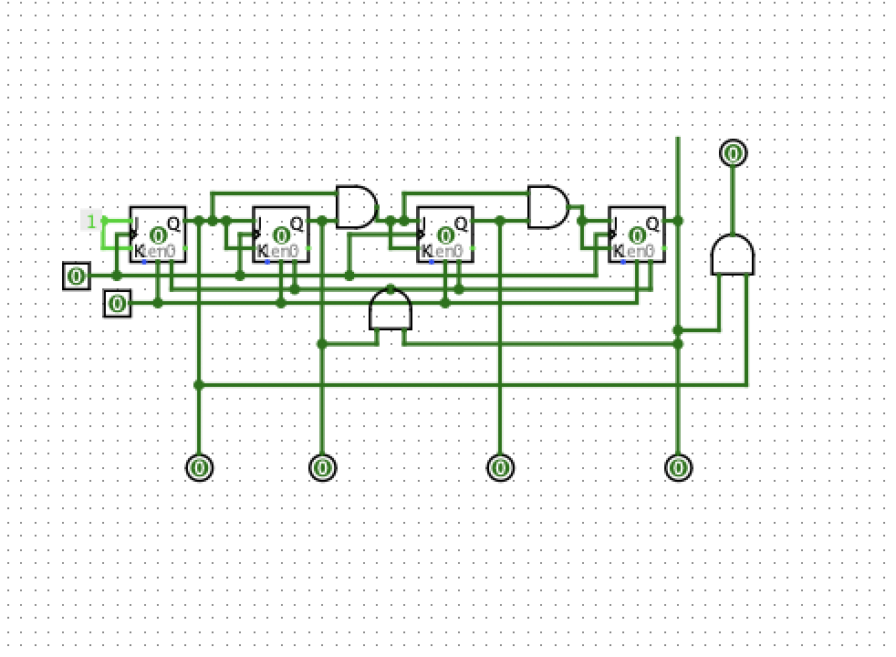
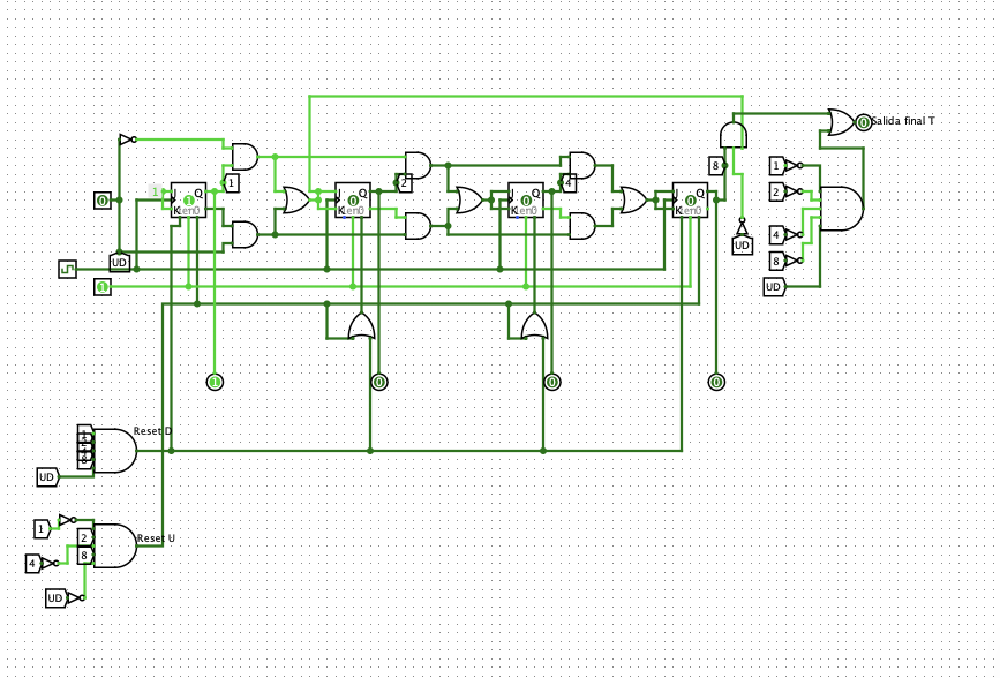
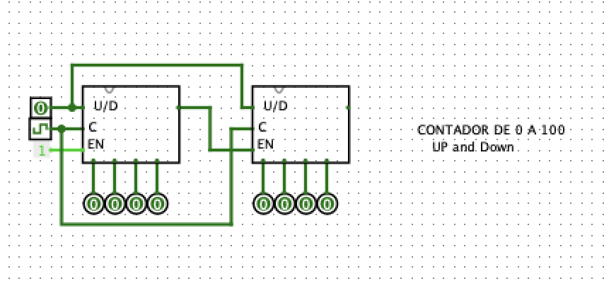

# ContadorUpDown
Contador UP/DOWN de 0 a 100
## Circuito en Logisim 
[Esquemático](/Contador.circ)
## Fotos
### FF JK 

### Contador de 4 bits

### Contador de décadas

### Contador UpDown circuito 

